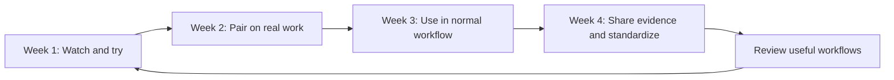
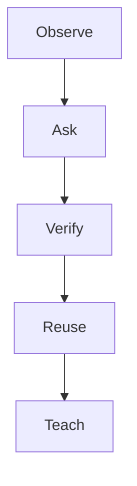

# Adoption and Coaching Prompts

These prompts help teams introduce IBM Bob without treating experienced developers like beginners.

## First-use prompt

```text
Act as a careful IBM i development assistant.

I am an experienced IBM i developer who is new to IBM Bob. Do not assume I want a large rewrite or a new architecture.

For the supplied source:
1. Explain what the program does in plain IBM i terms.
2. Identify files, programs, procedures, service programs, copy members, commands, and external interfaces it appears to use.
3. Separate confirmed facts from inferences.
4. Point to the exact source evidence for each important conclusion.
5. List questions I should answer before changing anything.
6. Do not modify code.
```

## Legacy-code explanation prompt

```text
Review [program or source member].

Produce:
- business purpose
- entry parameters
- major processing stages
- database reads and writes
- calls to other programs or procedures
- error and exception handling
- hidden assumptions
- likely regression risks

Use language familiar to an RPG developer. Mark every uncertain conclusion as an inference.
```

## Paired-learning prompt

```text
Help two developers learn IBM Bob while completing real work.

Developer A knows the application well.
Developer B is learning the application and IBM Bob.

For [task]:
1. Create a five-minute orientation.
2. Suggest three questions Developer B should ask Bob.
3. Identify what Developer A must verify.
4. Provide one deliberately narrow task Bob can perform safely.
5. End with a short retrospective: what was useful, wrong, missing, or unexpectedly valuable?
```

## Code-review preparation prompt

```text
Prepare a human code review for this IBM i change.

Do not approve the change.

Review for:
- stated intent versus actual diff
- RPG correctness
- SQL correctness and performance risk
- error handling
- authority assumptions
- transaction boundaries
- backward compatibility
- missing tests
- deployment and rollback concerns

Return review questions and evidence, not a final approval decision.
```

## Adoption retrospective

```text
Evaluate this IBM Bob session.

Task attempted: [task]
Developer experience level: [level]
Bob output: [paste or reference output]
Final human decision: [decision]

Classify:
- what Bob got right
- what Bob missed
- what required correction
- what remained unverified
- whether the session reduced time, risk, or neither
- whether this prompt should be reused, revised, or retired
```

## 30-day adoption flow



## Beginner adoption ladder



## Team adoption review prompt

```text
Review IBM Bob adoption for the team using these inputs:
- weekly meaningful users
- common use cases
- reusable prompts created
- examples of time or risk reduced
- developer confidence ratings
- Bobcoin usage trends

Do not rank developers by token use alone.

Identify:
1. skill blockers
2. trust blockers
3. tooling blockers
4. governance blockers
5. useful workflows worth standardizing
6. waste patterns such as overly long threads or repeated context
7. three actions for the next two weeks
```
