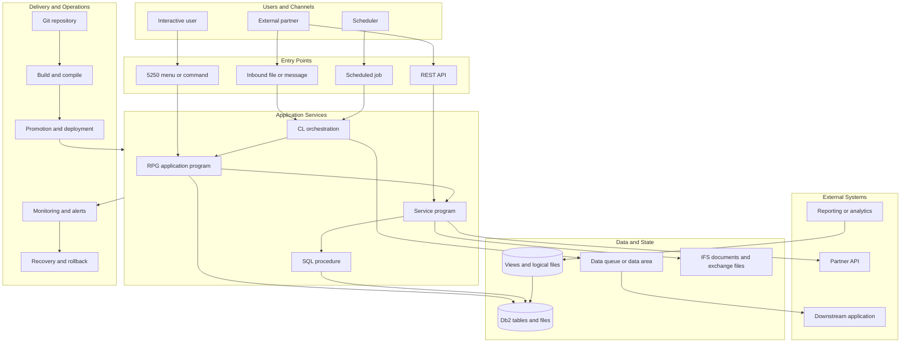
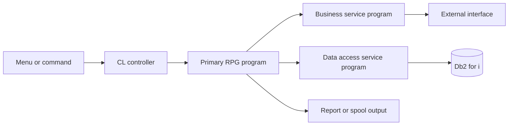
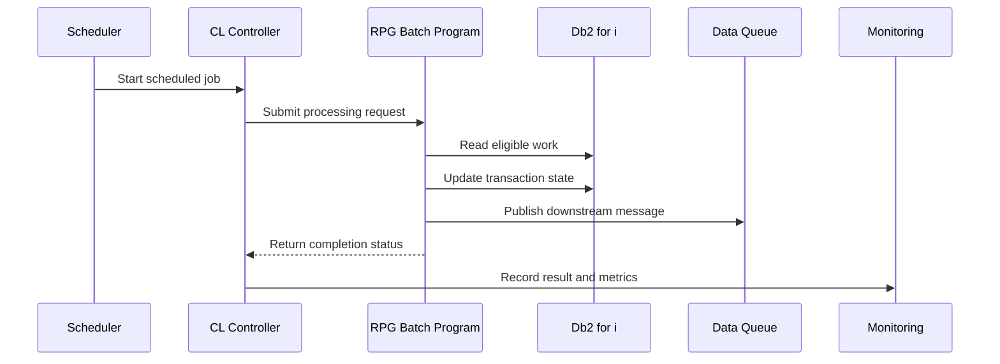

# Complete System Mapping Prompts

A complete system map should connect business entry points, programs, services, data, integrations, operations, security, deployment, and recovery. It is a maintained engineering artifact, not a decorative diagram.

## Complete system discovery prompt

```text
Build an evidence-based system map for [application or business capability].

Include:
1. users, roles, and entry channels
2. menus, commands, jobs, APIs, files, messages, and scheduled triggers
3. RPG, CL, COBOL, SQL, Java, modules, procedures, and service programs
4. callers, callees, binding directories, copy members, and shared structures
5. Db2 tables, physical files, logical files, views, indexes, data areas, data queues, and IFS locations
6. external systems, interfaces, transports, file exchanges, and message flows
7. subsystems, job queues, output queues, scheduled jobs, restart points, and batch dependencies
8. authority boundaries, service profiles, secrets, and sensitive-data zones
9. Git repositories, source locations, build commands, compile objects, promotion steps, and deployment paths
10. monitoring, logging, alerting, support ownership, recovery, rollback, and known failure modes

For each node and relationship:
- cite the evidence
- classify it as confirmed, inferred, or unverified
- identify the owner when known
- identify the validation step when uncertain

Do not omit operational dependencies simply because they are outside the source repository.
```

## Layered system map



## Program and service dependency map



## Batch flow example



## Field and data-flow tracing prompt

```text
Trace the business value [field or concept] through the system.

Do not search only for the original field name.

Follow:
- assignments and moves
- differently named receiving fields
- data structures and copy members
- parameters and return values
- SQL aliases and expressions
- work files and staging tables
- child and history records
- exports, reports, messages, and APIs

Produce a Mermaid flowchart showing every confirmed transformation. List unresolved gaps and the evidence needed to close them.
```

## Operational mapping prompt

```text
Map how [application or batch process] runs in production-like operations without accessing production data.

Identify:
- initiating job or user
- subsystem and job queue
- job description and user profile
- libraries and library-list assumptions
- configuration data areas or files
- restart and recovery points
- output queues and logs
- monitoring and alert paths
- support owner and escalation path
- rollback or compensating action

Separate source-confirmed facts from environment-specific facts that require operator validation.
```

## System-map review questions

- What starts the flow?
- What can stop it?
- Where is state committed?
- What can be retried safely?
- Which relationships depend on naming conventions rather than enforced definitions?
- What runs outside the repository?
- Where are authority changes or trust boundaries crossed?
- Which downstream consumers are not visible from the immediate source?
- How is failure detected?
- Who owns recovery?
- How is the map kept current after a code or schema change?
