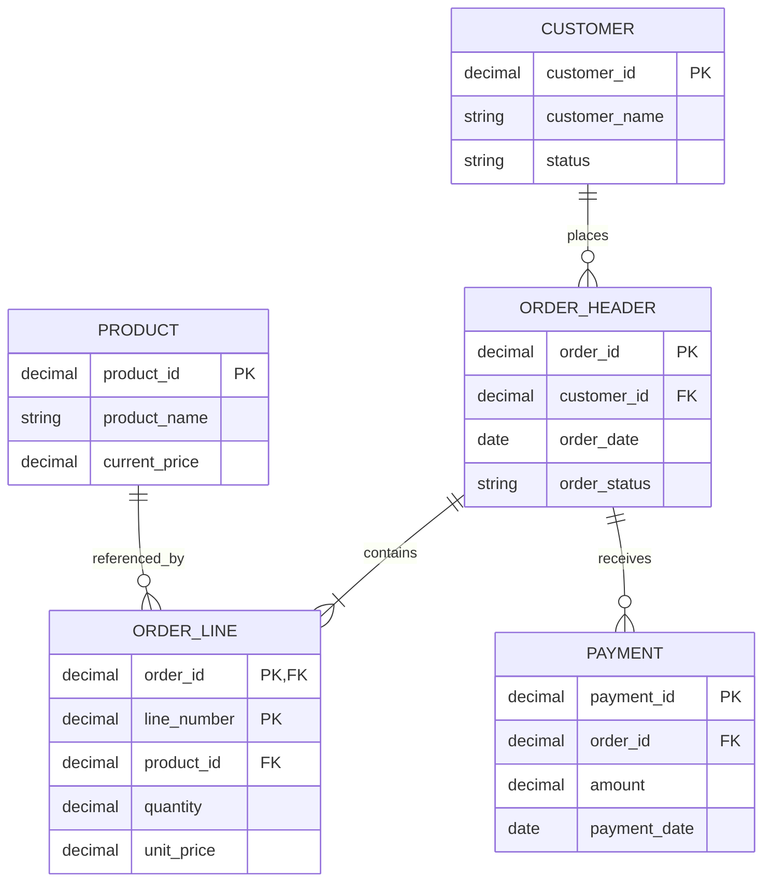

# Database Discovery and ERD Prompts

Use these prompts before changing a Db2 for i data model. The goal is to create a validated working model, not to let an agent invent relationships.

## Database discovery prompt

```text
Analyze the database objects used by [application, library, program set, or feature].

Build an evidence-based inventory of:
- physical files and SQL tables
- logical files, SQL views, aliases, and indexes
- primary keys and unique constraints
- foreign keys enforced by Db2
- relationships enforced only by application logic
- journaling and commitment-control assumptions
- history, work, staging, and temporary tables
- nullable and optional relationships
- duplicate or overloaded business keys
- files read or updated by RPG, CL, COBOL, SQL, Java, APIs, or batch jobs

For every relationship, label the evidence as one of:
- Db2-enforced
- source-confirmed
- name-based inference
- data-movement inference
- unverified

Do not invent cardinality. List missing evidence and validation queries.
```

## ERD construction prompt

```text
Create a Mermaid entity-relationship diagram for [scope].

Requirements:
1. Include only entities supported by evidence.
2. Show primary keys, foreign keys, and important business keys.
3. Distinguish Db2-enforced relationships from application-enforced relationships in the accompanying notes.
4. Do not place unsupported assumptions in the diagram.
5. Add a validation table with entity, relationship, evidence, confidence, and verification step.
6. Keep the first diagram to the core transactional model. Put work, staging, history, and reporting objects in separate diagrams when necessary.
```

## Example ERD



## Relationship validation prompt

```text
Validate the proposed relationship between [object A] and [object B].

Check:
- Db2 constraints
- indexes and access paths
- join predicates in embedded and dynamic SQL
- keyed CHAIN, SETLL, READE, and similar RPG access
- data copied through work fields or data structures
- batch and interface transformations
- nullable values and orphan behavior
- delete and update behavior

Return:
- confirmed relationship
- likely cardinality
- exact evidence
- contradictory evidence
- SQL queries or source locations needed for final verification
```

## Schema-change impact prompt

```text
Assess the impact of changing [column, field, key, table, or file].

Search for:
- source definitions
- externally described data structures
- copy members
- program-described structures
- field aliases and differently named receiving fields
- SQL statements
- logical files, views, indexes, and constraints
- reports, exports, APIs, queues, and IFS files
- work tables and history tables
- tests and deployment scripts

Create an impact matrix with object, use, evidence, risk, owner, required change, and validation step.
```

## ERD review checklist

- Every entity has a clear purpose.
- Keys are supported by definitions or verified business rules.
- Cardinality is not guessed from names.
- Application-enforced relationships are documented separately.
- History and staging objects are not confused with authoritative tables.
- Views and logical files are traced to base objects.
- Sensitive fields and authority boundaries are noted.
- The diagram has a stated scope and review date.
