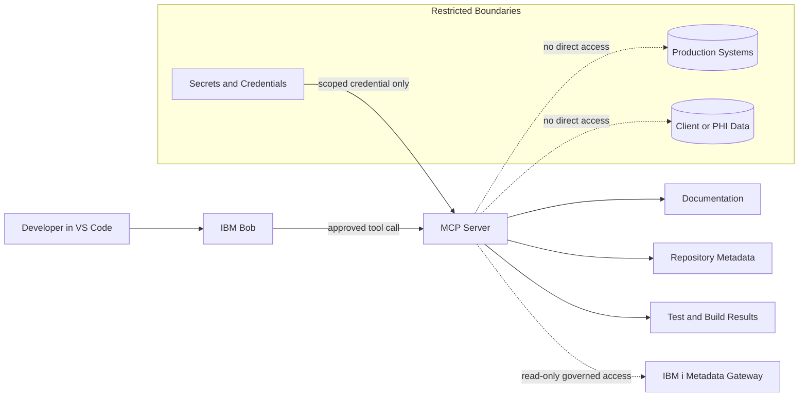
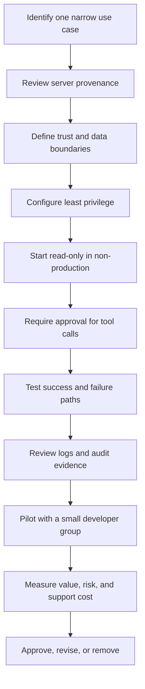

# Extensions and MCP Review Prompts

Use these prompts to evaluate additions to the development environment without turning the workstation into an ungoverned collection of tools.

## Extension evaluation prompt

```text
Evaluate the proposed VS Code extension [name and marketplace URL] for an IBM i development team.

Review:
- publisher identity and reputation
- maintenance activity and release history
- permissions and data access
- telemetry and privacy behavior
- network access and external services
- workspace trust implications
- overlap with Code for IBM i, Db2 for IBM i, IBM i Testing, IBM i Languages, RPGLE, CLLE, Git, or IBM Bob
- compatibility with the current VS Code and team platform
- license and commercial restrictions
- security advisories or known concerns
- installation scope: required, recommended, optional, pilot-only, or reject

Return:
1. plain-language purpose
2. expected value
3. risks and unanswered questions
4. controlled pilot plan
5. uninstall and rollback plan
6. final recommendation with evidence
```

## Conservative extension stack

Start with the smallest useful set:

- Code for IBM i
- Db2 for IBM i
- RPGLE
- CLLE
- IBM i Testing
- IBM i Languages
- Git support included with VS Code
- EditorConfig when the repository uses it
- Markdown linting and preview support for documentation-heavy projects
- A spell checker for prose, comments, and documentation

Add tools only when a real workflow requires them.

## MCP server evaluation prompt

```text
Evaluate the proposed MCP server [server name, repository, package, or endpoint].

Describe:
- the business and developer use case
- tools, resources, and prompts it exposes
- transport used: STDIO, Streamable HTTP, or legacy SSE
- authentication method
- credentials and secrets required
- systems and data it can reach
- read, write, execute, and administrative capabilities
- logging and auditability
- package provenance and update model
- failure behavior and timeout behavior
- least-privilege configuration
- whether tool calls require human approval
- production, client-data, PHI, and sensitive-data boundaries

Classify the proposal as:
- suitable for a read-only pilot
- suitable after controls are added
- unsuitable for the current environment

Provide a pilot plan that begins with non-production data and the narrowest possible permissions.
```

## Good first MCP use cases

- Read-only documentation search
- Read-only issue and work-item lookup
- Repository metadata and pull-request context
- Build and test result retrieval
- Controlled access to approved architecture inventories
- Read-only IBM i metadata through a governed gateway

Avoid beginning with production access, broad shell execution, unrestricted database writes, deployment privileges, or access to client data.

## MCP trust-boundary diagram



## MCP tool-quality prompt

```text
Review the MCP tool definition [tool name and schema].

Check whether:
- the name clearly states the action
- the description defines scope and side effects
- required inputs are unambiguous
- defaults are safe
- write operations are distinct from read operations
- errors are specific and actionable
- output contains evidence and identifiers
- retries are safe and idempotent where appropriate
- sensitive values are excluded from logs and output
- the tool can be tested without production access

Rewrite the name, description, and schema guidance where necessary. Do not broaden the tool's authority.
```

## Agent-workflow improvement prompt

```text
Improve this IBM Bob agent workflow without making the prompt larger than necessary.

Current goal: [goal]
Current prompt or agent instructions: [text]
Available extensions and MCP tools: [list]
Observed problems: [hallucination, missed files, excessive tokens, weak evidence, incorrect tool choice, timeout, repeated work, or other]

Recommend:
1. one clear goal
2. required context only
3. explicit boundaries
4. a plan-before-action step
5. the minimum necessary tools
6. approval points for side effects
7. evidence required in the final result
8. stopping conditions
9. validation and test steps
10. what should be moved into reusable project rules or a focused skill
```

## MCP adoption sequence



## Review checklist

- The extension or server solves a named problem.
- Ownership and support are clear.
- Permissions are no broader than necessary.
- Read and write operations are separated.
- Secrets are not embedded in repository files.
- Production and sensitive-data access are prohibited unless separately governed and explicitly approved.
- Human approval remains at meaningful control points.
- Logs support investigation without exposing sensitive information.
- Updates and version changes are reviewed.
- Removal and rollback are documented.
